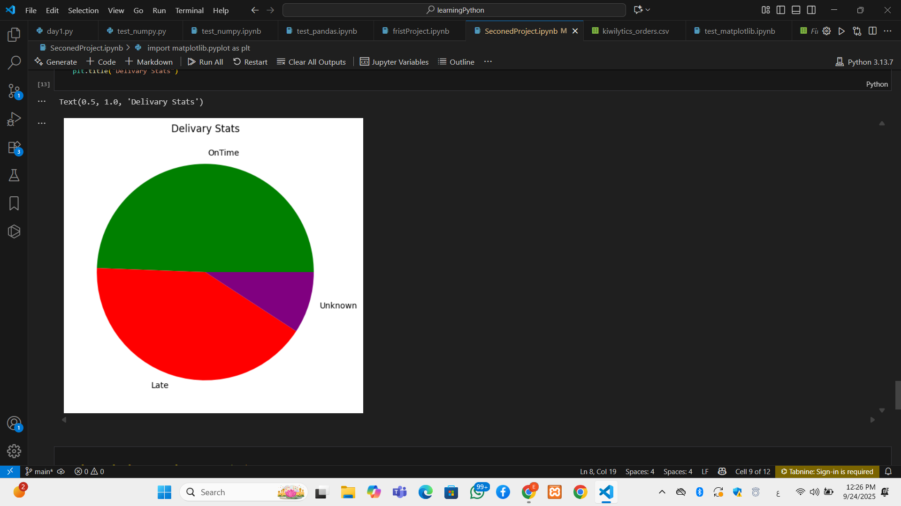
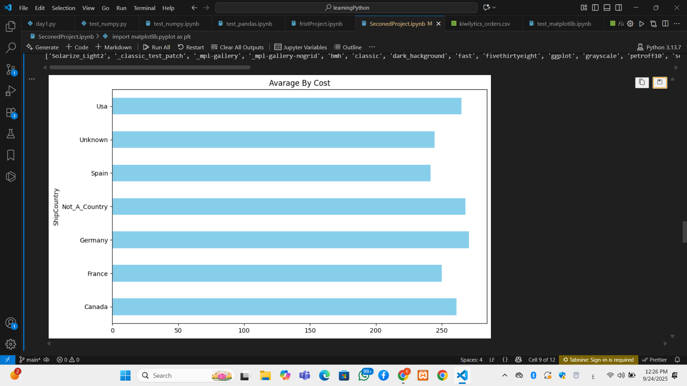

# cleanig-Data-Set
Data cleaning project for an orders dataset using NumPy, Pandas, and Matplotlib (handling missing values, duplicates, and inconsistencies).
## 🔹 Key Steps
- Handle missing values.
- Fix inconsistent formatting.
- Data exploration using Pandas.
- Visualization with Matplotlib.
  ## ⚙️ Requirements
- Python 3.x
- NumPy
- Pandas
- Matplotlib
## ▶️ How to Run
1. Clone this repository:
   ```bash
   git clone https://github.com/EsraaGamal2024/cleanig-Data-Set
  ## 📊 Results
- Clean dataset with no missing values or duplicates.
- Clear visualizations showing data distribution.
### Example Visualizations:


